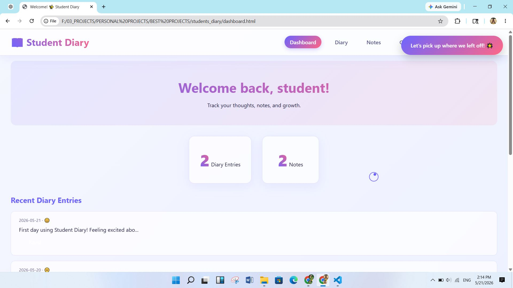
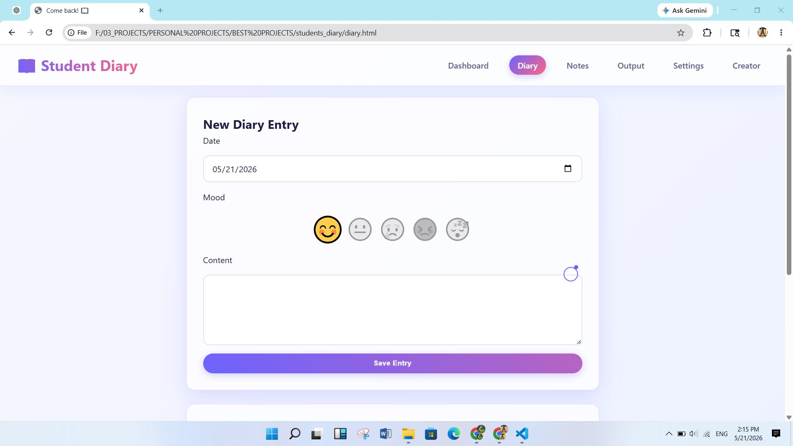
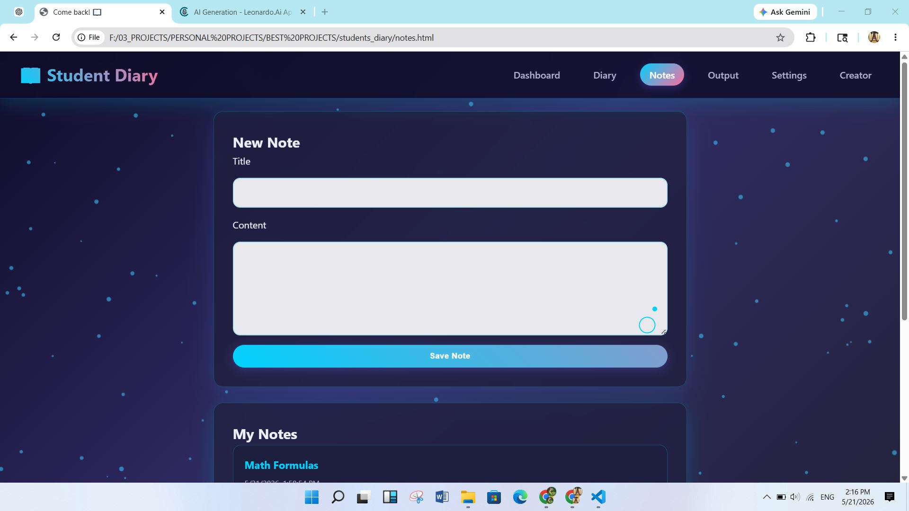
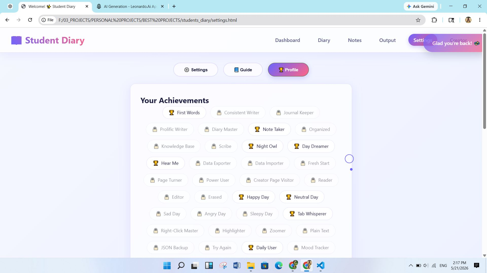
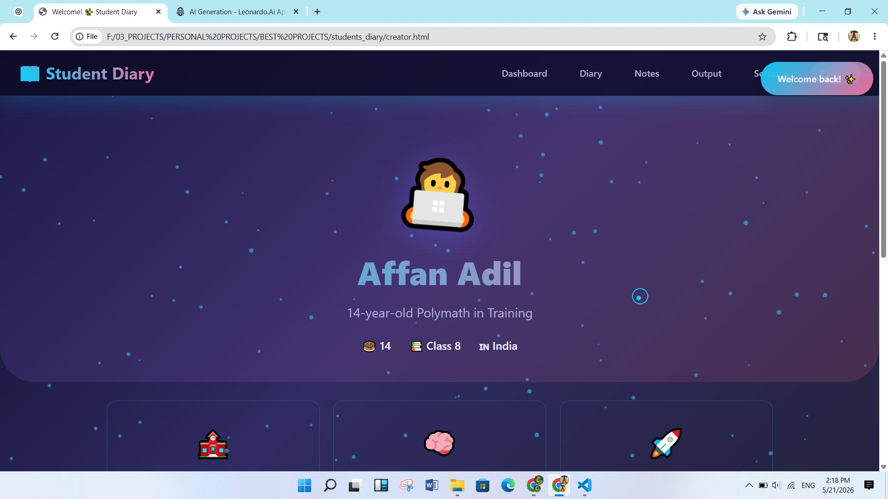
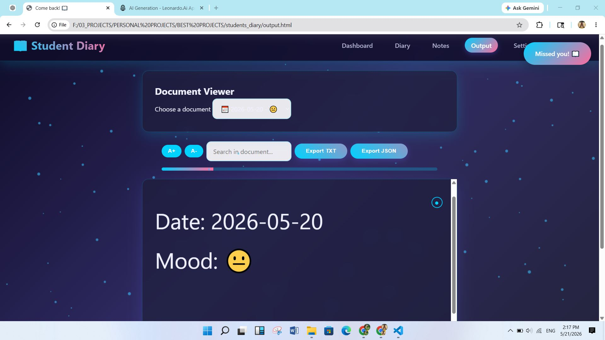

<div align="center">

# 📚 Students Diary

### A Modern, Feature-Rich Digital Diary Application for Students
*Write, organize, and track your academic journey with achievements and mood tracking*


</div>

---

## ✨ About

**Students Diary** is a beautifully designed, feature-packed digital diary application built for students who want to maintain a personal journal, track their mood, and organize their thoughts. With an intuitive interface, dark mode support, and a comprehensive achievement system, it makes journaling engaging and rewarding.

Built with **vanilla JavaScript** and responsive design principles, it works seamlessly across all devices without requiring any backend server.

---

## 🎯 Features

- 📝 **Rich Diary Entries** - Write unlimited diary entries with date and mood tracking
- 🎭 **Mood Tracking** - Express your feelings with intuitive mood emojis (😊 😐 😢 😡 😴)
- 📋 **Smart Notes** - Create and organize quick notes and study materials
- 🏆 **Achievement System** - Unlock 20+ achievements as you use the app (motivation boost!)
- 🌙 **Dark & Light Themes** - Toggle between themes for comfortable viewing any time
- 🔊 **Sound Effects** - Optional audio feedback for interactions
- ⌨️ **Keyboard Shortcuts** - Power user shortcuts for rapid navigation
- 🎨 **Beautiful UI/UX** - Modern, clean interface with smooth animations
- 💾 **Local Storage** - All data stored securely in browser (no server needed)
- 📊 **Analytics Dashboard** - View statistics and insights about your entries
- 🎉 **Particle Effects** - Engaging visual effects for motivation
- 📱 **Fully Responsive** - Perfect experience on mobile, tablet, and desktop
- ⚡ **Zero Dependencies** - Pure vanilla JavaScript, HTML, and CSS
- 🎯 **Custom Context Menu** - Enhanced right-click experience
- 📤 **Data Export** - Export your data for backup or sharing

---

## 🖼️ Screenshots

<div align="center">

### Home Dashboard

*Clean and intuitive home page with quick navigation*

### Diary Page

*Create and manage your diary entries with mood tracking*

### Notes Section

*Organize your notes and study materials efficiently*

### Achievements

*Unlock achievements and stay motivated*

### Creator Page

*Learn about the project and its creator*

### Reader/Output View

*Beautiful formatted view of your entries*

</div>

---

## 🛠️ Tech Stack

| Category | Technology |
|----------|-----------|
| **Frontend** | HTML5, CSS3, Vanilla JavaScript |
| **Styling** | CSS3 (Flexbox, Grid, Animations) |
| **State Management** | Browser LocalStorage API |
| **Architecture** | Vanilla JS Modules |
| **Design Pattern** | Responsive Mobile-First |
| **Additional Features** | Canvas Particles, Custom Events |

---

## 🚀 Getting Started

### Prerequisites
- A modern web browser (Chrome, Firefox, Safari, Edge)
- No installation required!

### Installation

1. **Clone the repository:**
   ```bash
   git clone https://github.com/yourusername/students_diary.git
   cd students_diary
   ```

2. **Open the application:**
   - Simply open `index.html` in your web browser
   - Or set up a local server:
     ```bash
     # Using Python 3
     python -m http.server 8000
     
     # Using Node.js (http-server)
     npx http-server
     ```

3. **Access the app:**
   ```
   http://localhost:8000
   ```

### Live Demo
*[Add your hosted link here]*

---

## 📖 Usage

### Writing a Diary Entry
1. Navigate to the **Diary** page
2. Select a date and mood emoji
3. Write your thoughts and experiences
4. Click "Save Entry" to store it locally

### Creating Notes
1. Go to the **Notes** section
2. Click "New Note"
3. Add a title and content
4. Notes are automatically saved

### Unlocking Achievements
- Complete various tasks to unlock achievements
- Examples: Write 5 entries, use dark mode, edit entries, etc.
- View all achievements in the **Achievements** page

### Theme Management
- Click the theme toggle in settings to switch between light and dark modes
- Your preference is saved automatically

### Data Export
- Visit **Settings** page to export your data as JSON
- Import previously exported data to restore your entries

### Keyboard Shortcuts
Press `?` or check the help menu for available keyboard shortcuts

---

## 📁 Folder Structure

```
students_diary/
├── 📄 index.html          # Main entry point
├── 📄 diary.html              # Diary entries page
├── 📄 notes.html              # Notes section
├── 📄 creator.html            # Creator information
├── 📄 settings.html           # Settings & preferences
├── 📄 output.html             # Reader/viewer page
│
├── 📁 css/                    # Stylesheets
│   ├── main.css               # Main styles
│   ├── dashboard.css          # Dashboard styling
│   ├── diary.css              # Diary page styles
│   ├── notes.css              # Notes page styles
│   ├── dark_theme.css         # Dark mode theme
│   ├── responsive.css         # Mobile responsiveness
│   ├── preloader.css          # Loading animation
│   ├── context-menu.css       # Custom context menu
│   └── [other styles]
│
├── 📁 js/                     # JavaScript modules
│   ├── common.js              # Shared utilities & initialization
│   ├── dashboard.js           # Dashboard functionality
│   ├── diary.js               # Diary entry management
│   ├── notes.js               # Notes management
│   ├── achievements.js        # Achievement system
│   ├── settings.js            # Settings page logic
│   ├── keyboard.js            # Keyboard shortcuts
│   ├── context-menu.js        # Custom context menu
│   ├── particles.js           # Particle effects
│   ├── custom-cursor.js       # Cursor effects
│   ├── click-sound.js         # Sound effects
│   ├── preloader.js           # Loading screen
│   ├── tab-title.js           # Dynamic tab title
│   └── output.js              # Output/reader page
│
├── 📁 assets/
│   └── 📁 screenshots/        # Application screenshots
│
└── 📄 README.md               # This file
```

---

## 🎮 Features In-Depth

### 🏆 Achievement System
Unlock **20+ achievements** including:
- **First Words** - Write your first diary entry
- **Consistent Writer** - Reach 5 diary entries
- **Journal Keeper** - Reach 10 entries
- **Diary Master** - 50 entries milestone
- **Night Owl** - Switch to dark mode
- **Power User** - Use keyboard shortcuts
- **Data Exporter** - Export your data
- **Reader** - Open multiple documents
- ...and many more!

### 🎨 Customization
- **Theme Options**: Light & Dark modes with smooth transitions
- **Sound Toggle**: Enable/disable click sounds
- **Responsive Layout**: Adapts to any screen size
- **Custom Cursor**: Unique cursor design throughout the app

### 💾 Data Management
- **Auto-Save**: All entries saved to LocalStorage automatically
- **No Server Required**: Your data stays on your device
- **Export Feature**: Download your data as JSON backup
- **Import Feature**: Restore from previous exports

---

## 🔮 Future Improvements

- [ ] Cloud synchronization across devices
- [ ] Search and filter functionality
- [ ] Tags and categories for entries
- [ ] Advanced statistics and analytics dashboard
- [ ] Data encryption for privacy
- [ ] Mobile app (React Native/Flutter)
- [ ] Sharing entries securely
- [ ] Multiple user profiles
- [ ] Rich text editor with formatting
- [ ] Integration with calendar
- [ ] AI-powered mood insights
- [ ] Export to PDF format
- [ ] Collaborative features
- [ ] Reminder notifications
- [ ] Voice notes support

---

## 🤝 Contributing

Contributions are welcome! Here's how you can help:

1. **Fork the repository**
2. **Create a feature branch** (`git checkout -b feature/AmazingFeature`)
3. **Commit your changes** (`git commit -m 'Add some AmazingFeature'`)
4. **Push to the branch** (`git push origin feature/AmazingFeature`)
5. **Open a Pull Request**

### Areas for Contribution:
- Bug fixes and improvements
- UI/UX enhancements
- New features
- Documentation
- Translations
- Performance optimization

---

## 📝 License

This project is licensed under the **MIT License** - see the LICENSE file for details.

---

## 👨‍💻 Author

**Created by:** [Your Name/GitHub Username]

- GitHub: [@yourusername](https://github.com/affan675)
- Portfolio: [https://affan675.github.io/01_portfolio_v2]
- Email: affanadil119@gmail.com

---

## 🙏 Acknowledgments

- Inspired by the love for journaling and self-reflection
- Built with passion for helping students organize their thoughts
- Special thanks to all contributors and users
- Particle.js for awesome effects
- The open-source community

---

## 📞 Support

Have questions or found a bug? 

- 🐛 **Report Issues**: [GitHub Issues](https://github.com/affan675/13_students_diary/issues)
- 💬 **Discussions**: [GitHub Discussions](https://github.com/affan675/13_students_diary/discussions)
- 📧 **Email**: affanadil119@gmail.com

---

<div align="center">

### ⭐ If you find this project helpful, please consider giving it a star!

**Made with ❤️ for students everywhere**

[Back to Top ⬆️](#-students-diary)

</div>
